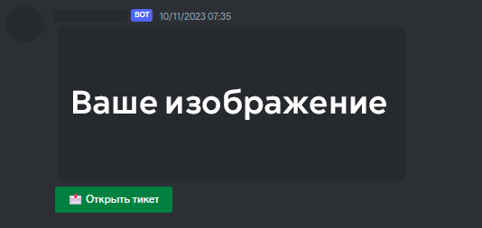
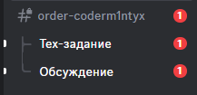
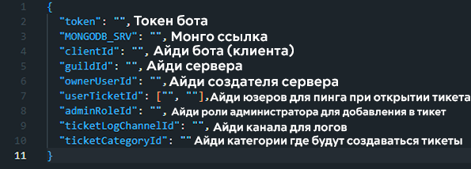

# Бот по тикетам Discord 
Данный дискорд бот написан на [Node js 17.9.0](https://nodejs.org/en/blog/release/v17.9.0) с использованием библиотеки [discord.js v14.11.0](https://discord.js.org/#/docs/discord.js/14.11.0/general/welcome) с очень гибкой конфигурацией
> Этот бот идеально подходит для дизайн студий! Неужели это не круто?

## Когда открыли тикет (Отлично подходит дизайнерам!):

# Запуск
- Пукнт **1**: Подготовка
- - `npm install` в терминал
- - Заполнить конфиг `config.json`
- 
- Как получить ссылку в MongoDB, [клик](https://www.mongodb.com/basics/mongodb-connection-string)
- Как получить токен бота, [клик](https://www.mongodb.com/basics/mongodb-connection-string](https://discordjs.guide/creating-your-bot/#using-config-json))
- Пукнт **2**: Оформление эмбеда для открытия тикета
- - Перейдите в `commands/tickets/ticket.js`
- - Оформите `embed` как Вам удобно
- Пункт **3**: Оформление каналов и веток при открытии тикета
- - Перейдите в `events/interaction.js`
- - с 59 строки до 245 строки, вся настройка (с комментариями в коде) эмбедов, прав после **открытия** тикета.
- - с 246 строки до 274 строки, вся настройка (с комментариями в коде) логов, чистки бд и удаление канала после **закрытия** тикета
- Пукнт **3**: Компиляция кода
- - `node index.js` в терминал
- - Проверьте есть ли у бота **права** на сервере
- - Используйте команду ``/sendticket`` в канале куда должен скинуться эмбед для открытия тикета
- - При ошибках проверьте все ли вы записали в конфиге и нету ли ошибок в эмбедах/айди!

# Насслаждайтесь!
## Хотите купить личных ботов на свой сервер? Пишите мне в [Discord](https://discordapp.com/users/1122241853773840425) (User Id: `1122241853773840425`)
## В конце я хочу же Вас попросить поставить ⭐ на этот репозиторий
